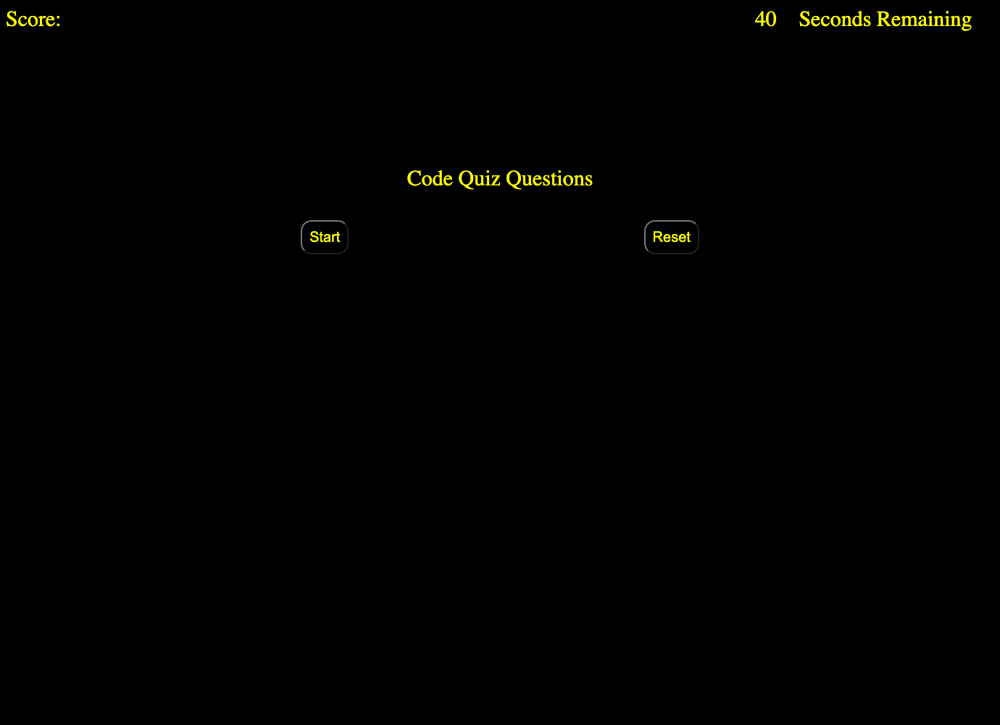
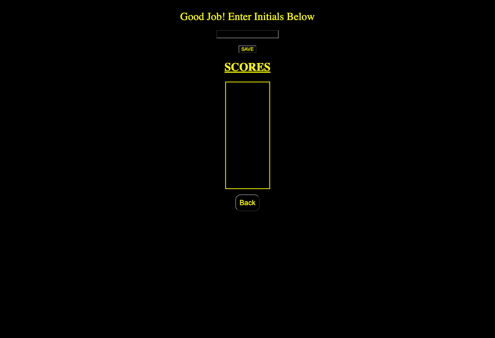

# Timed-Coding-Quiz

https://stefanpodz303.github.io/Timed-Coding-Quiz/

## Description and Purpose of Work
--Created a multiple choice timed coding quiz from scratch.
--The quiz and timer starts at click of the start button.
--The quiz renders one question at a time.
--Moves to next question when an answer is chosen.
--5 points is awarded for a correct answer.
--A player is penalized 10 secs for a wrong answer.
--Once quiz is complete or timer reaches 0 the user is presented with a scores page that displays their score and they are able to add their initials.
--Scores and intitals are stored until reset.